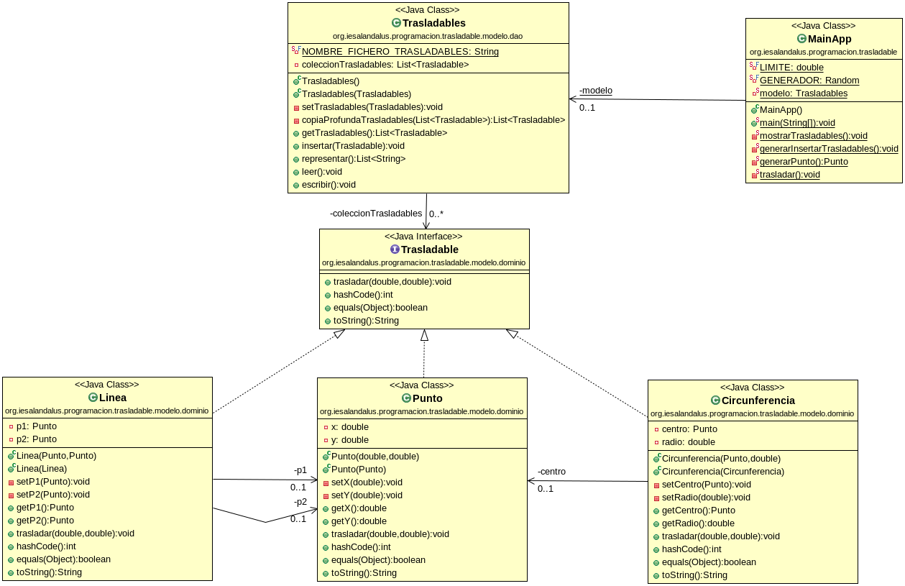

# Tarea presencial PROG05-08. Curso 2018/2019
## Profesor: Andrés Rubio del Río
Tu tarea consiste en implementar una aplicación que leerá un fichero con objetos trasladables, lo cargará en una lista (ArrayList) y los listará, generará 1 punto, 1 línea y una circunferencia que añadirá a la lista, las listará, recorrerá la lista y para cada objeto trasladable lo trasladará un desplazamiento aleatorio en x y en y e insertará el nuevo objeto trasladado en la lista para finalmente volver a mostrar toda la lista y guardará todos los objetos de la lista en el fichero. Para ello te recomiendo seguir las siguientes pautas:

- El diagrama de clases que debes implementar es el siguiente:

- En el siguiente repositorio: [repositorio GitHub esqueleto tarea](https://github.com/andresrubiodelrio/Trasladables_v1) encontrarás un esqueleto de la aplicación gradle y las pruebas para las clases de dominio del modelo comentadas que deberás descomentar para poder ejecutarlas.
- **(4 puntos)** Implementa correctamente la jerarquía de clases dada. Ten en cuenta el problema del aliasing tanto a la hora de devolver referencias como de quedarte con ellas. En todos los métodos en los que se pase algún valor `null` se deberá comprobar y lanzar la excepción `NullPointerException`.
- **(3 puntos)** Implementa correctamente la clase dao `Trasladables`. Debes gestionar los datos mediante una lista (ArrayList) de objetos trasladables (polimórficos). Tendrá su constructor por defecto y su constructor copia. El método `getTrasladables` devolverá una copia profunda de la lista de objetos trasladables. El método `insertar` añadirá el objeto a la lista si este no existe y no es nulo. El método `representar` simplemente devolverá una lista de cadenas con la representación de cada uno de los objetos. Ten en cuenta el problema del alisasing.
- **(2 puntos)** Haz que la clase dao `Trasladables` también permita escribir la lista de objetos trasladables en un fichero y que permita leer el fichero y almacenar en la lista los objetos contenidos en dicho fichero. Haz los cambios necesarios también en las clases de dominio que consideres adecuadas. A los ficheros deberás acceder mediante su ruta relativa.
- **(1 punto)** Crea la aplicación principal tal y como se muestra en el diagrama de clases. Debes apoyarte en los métodos auxiliares que se especifican.

#####Se valorará:

- La nomenclatura del repositorio de GitHub y del archivo entregado sigue las indicaciones de entrega.
- La indentación debe ser correcta en cada uno de los apartados.
- El nombre de las variables debe ser adecuado.
- Se debe utilizar la clase Entrada para realizar la entrada por teclado.
- El proyecto debe pasar todas las pruebas que van en el esqueleto del mismo y toda entrada del programa será validada para evitar que el programa termine abruptamente debido a una excepción.
- Se deben utilizar los comentarios adecuados.
- Se valorará la corrección ortográfica tanto en los comentarios como en los mensajes que se muestren al usuario.
